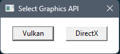
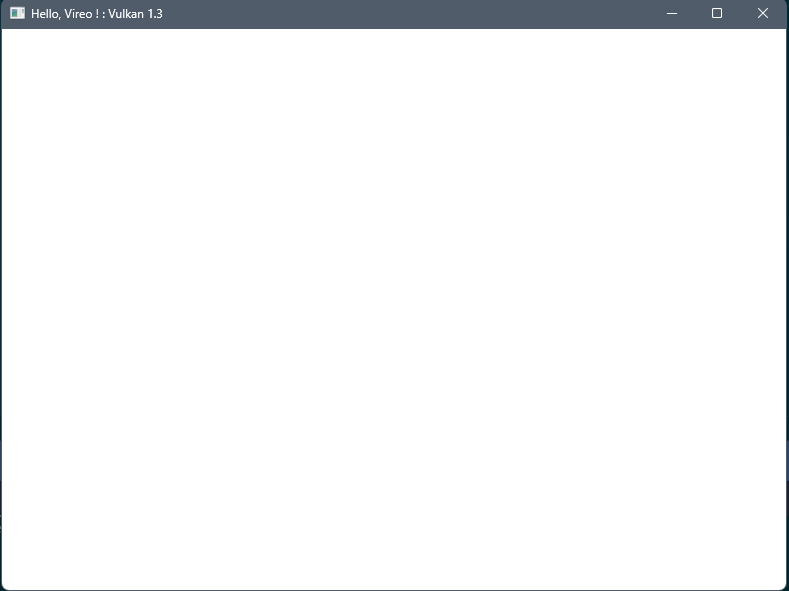
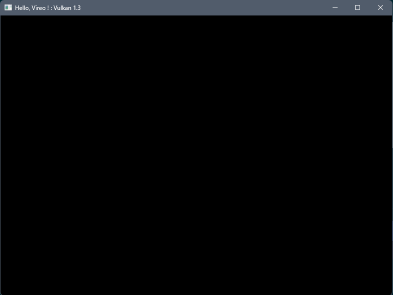
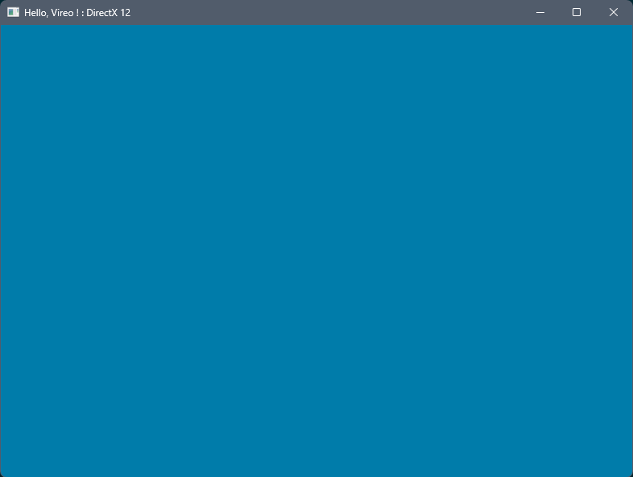
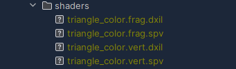
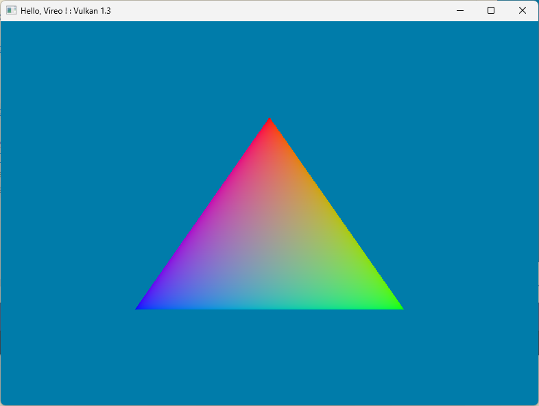
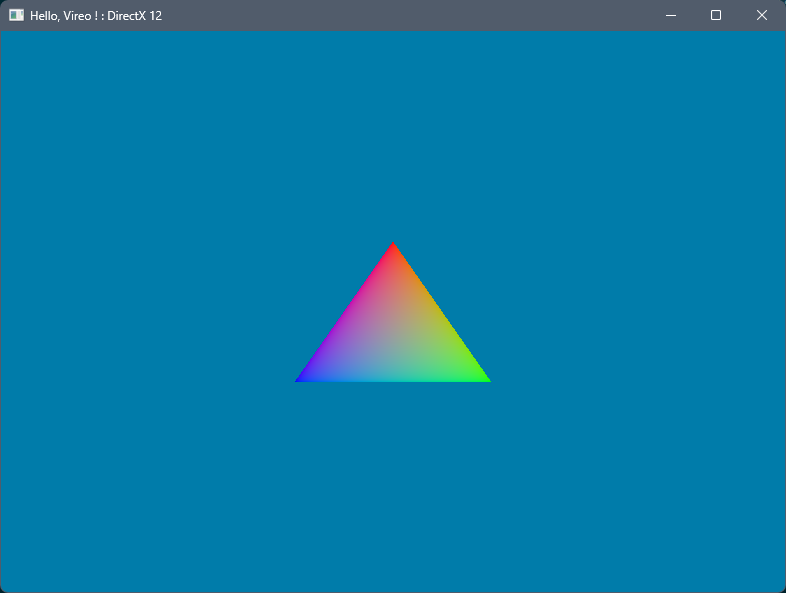

# Vireo RHI "Hello Triangle" tutorial

## Introduction
This tutorial will teach you the basics of using the Vireo Rendering Hardware
Interface.
Vireo is an open source library written in modern C++ that implements a 
common abstraction layer over multiple 3D graphics APIs.

Like modern graphics API, Vireo is a low-level library but is designed
to be less verbose, at the price of reduced flexibility.

This tutorial assumes that the reader already knows the basic concepts of the
modern graphics API like Vulkan or DirectX 12, like pipelines, descriptors,
resources, buffers, barriers, ...

Sources of the tutorial are available at https://github.com/HenriMichelon/vireo_tutorial_1

## Development environment

Since Vireo currently only supports Microsoft Windows this tutorial assumes that
you use this operating system.

We will be using CMake which means that you can use [Microsoft Visual Studio](https://visualstudio.microsoft.com/fr/) or
[Jetbrains CLion](https://www.jetbrains.com/clion/) to edit and compile your code.
Note that you need to install the CMake component for Visual Studio.

Since Vireo implements a DirectX 12 backend under Windows you need to install 
[Microsoft Visual C++ 2022 (MSCV 19+)](https://visualstudio.microsoft.com/fr/).
Vireo can be compiled with LLVM but only with the Vulkan back-end alone.

For DirectX 12 install the "Game Development with C++" component for Visual Studio.

For Vulkan install the [Vulkan SDK](https://vulkan.lunarg.com/)

The CMake scripts will automatically install the [GLM](https://github.com/g-truc/glm) library used in this tutorial

Finally, clone [the Vireo RHI repository](https://github.com/HenriMichelon/vireo_rhi)
somewhere in your computer.

## Setting up the project
Clone the [Vireo template project](https://github.com/HenriMichelon/vireo_template)
somewhere in your computer then adds a `.env.cmake` file containing the
following variable at the root of your project:

    set(VIREO_PROJECT_DIR "path_to_the_cloned_vireo_directory")

In the `src` directory creates :

A new `MyApp.ixx` interface file for your application :

    module;
    #include "Libraries.h"
    export module myapp;
    
    import app;
    
    export class MyApp : public Application {
    public:
        void onInit() override;
        void onRender() override;
        void onResize() override;
        void onDestroy() override;
    }

A new `MyApp.cpp` implementation file :

    module;
    #include "Libraries.h"
    module myapp;
    
    void MyApp::onInit() {
    }
    
    void MyApp::onRender() {
    }
    
    void MyApp::onResize() {
    }
    
    void MyApp::onDestroy() {
    }

And a new `MyAppMain.cpp` source file :

    #include "Macros.h"
    import myapp;
    
    APP(std::make_shared<MyApp>(), L"Hello, Vireo !", 1280, 720);

Update the `CMakeLists.txt` file by uncommenting the last part :

    ...
    
    #######################################################
    set(MY_TARGET_SRC
            ${SRC_DIR}/MyApp.cpp
            ${SRC_DIR}/MyAppMain.cpp)
    set(MY_TARGET_MODULES ${SRC_DIR}/MyApp.ixx)
    build_target(myapp "${MY_TARGET_SRC}" ${MY_TARGET_MODULES})

Then reload the CMake project and build the `myapp` target.

Execute the application (from the project root directory), it will display
the graphic API selection dialog :

Select an API and an empty window will be displayed :

## The Vireo class
The [Vireo](https://henrimichelon.github.io/Vireo/classvireo_1_1Vireo.html) class
encapsulate the creation of the various objects needed by the graphics API such as
the physical adapter and the logical device.
The instance of the `Vireo` class is stored in the `vireo` field of the base 
`Application` class of your project.
The creation of the instance is done in the os-specific main class 
(`Win32Application` for Windows) of your project after the user selects the 
runtime backend :

The `Vireo` class is the main class of the library; You need an instance of 
this class to create all the library objects.

## The submission queue
Most operations performed with graphics API, like draw commands and memory 
operations, are asynchronously executed by submitting them to a 
[SubmitQueue](https://henrimichelon.github.io/Vireo/classvireo_1_1SubmitQueue.html).
Queues are allocated from [command types](https://henrimichelon.github.io/Vireo/namespacevireo.html#a21e038f5b8958e203d28bc4f18472352), 
where each type supports a specific set of operations in its queues. 
For example, there could be separate queue families for graphics, compute and memory transfer operations.

Add a submission queue field to your application : 

    ...
    private:
        std::shared_ptr<vireo::SubmitQueue> graphicQueue;
    };

This queue will be used for all graphics commands and for presenting the result
in the window.

Create it in the `onInit()` method :
    
    void MyApp::onInit() {
        graphicQueue = vireo->createSubmitQueue(vireo::CommandType::GRAPHIC);
    }

and in the `onDestroy()` method add the code to wait for all the submitted commands
to finish before closing the application :
    
    void MyApp::onDestroy() {
        graphicQueue->waitIdle();
    }

## The swap chain
The swap chain is a collection of frame buffers. 
Its basic purpose is to ensure that the image that we're currently rendering 
to is different from the one that is currently on the screen. 
This is important to make sure that only complete images are shown. 
Every time we want to draw a frame we have to ask the swap chain to 
provide us with an image to render to. When we've finished drawing a frame, 
the image is returned to the swap chain for it to be presented to the 
screen at some point. 

We need a synchronization mechanism when we use a swap chain since the modern
graphics API executes commands asynchronously: we have to wait for the GPU to finish the
submitted work before reusing a frame buffer.

The CPU/GPU synchronization is done with a [Fence](https://henrimichelon.github.io/Vireo/classvireo_1_1Fence.html)
object. Since we can have multiple frames in flight (the GPU can render in 
multiple frame buffers in parallel), we need one `Fence` per frame buffer.

Add a `FrameData` `struct` and a `vector` of `FrameData` to your application:

    static constexpr auto FRAMES_IN_FLIGHT{2};
    struct FrameData {
        std::shared_ptr<vireo::Fence> inFlightFence;
    };
    std::vector<FrameData> framesData{FRAMES_IN_FLIGHT};

Create the fences after the queue creation in the `onInit()` method :

    for (auto& frameData : framesData) {
        frameData.inFlightFence = vireo->createFence();
    }

It's time to create the swap chain. Add a [SwapChain](https://henrimichelon.github.io/Vireo/classvireo_1_1SwapChain.html) field to your application interface:

    std::shared_ptr<vireo::SwapChain> swapChain;

We need the window handle to create the swap chain.  The window is created by the `Win32Application` and the os-specific handle
is stored in the `windowHandle` field of the base `Application` class.
We can use this field to create the swap chain, just after the `graphicQueue`
creation, in the `onInit()` method :

    swapChain = vireo->createSwapChain(
        vireo::ImageFormat::R8G8B8A8_SRGB,
        graphicQueue,
        windowHandle,
        vireo::PresentMode::VSYNC,
        FRAMES_IN_FLIGHT);

The swap chain needs to be recreated each time the window is resized :

    void MyApp::onResize() {
        swapChain->recreate();
    }

We have to wait for the last frame presentation to be finished before
closing the application :

    void MyApp::onDestroy() {
        graphicQueue->waitIdle();
        swapChain->waitIdle();
    }

Get the frame data corresponding to the current frame in
the `onRender()` method, acquire the next frame buffer (while waiting
for the frame buffer to be ready), then present it into
the window :

    void MyApp::onRender() {
        const auto& frameData = framesData[swapChain->getCurrentFrameIndex()];
        if (!swapChain->acquire(frameData.inFlightFence)) { return; }
    
        // commands will be recorded and submitted here
    
        swapChain->present();
        swapChain->nextFrameIndex();
    }

## Commands allocators and command lists
We can't execute the application now because the swap chain image needs
to be ready to be presented by the GPU before calling `present()`.
To make this frame buffer ready to be presented, we have to use a pipeline barrier
to synchronize resource like image between the different stages of a GPU pipeline.

A pipeline barrier is a GPU synchronization primitive that guarantees that any 
writes performed by those earlier stages are made visible (and available) 
to reads or writes in the later stages.

A pipeline barrier is created on the GPU with the help of a [CommandList](https://henrimichelon.github.io/Vireo/classvireo_1_1CommandList.html) 
and a command list is allocated by a [CommandAllocator](https://henrimichelon.github.io/Vireo/classvireo_1_1CommandAllocator.html).

The command list will also be used to record pipeline and drawing commands for
execution by the GPU.

Since we can render multiple frames in flight, we need one allocator and one list
per frame:
    
    ...
    struct FrameData {
        std::shared_ptr<vireo::Fence>            inFlightFence;
        std::shared_ptr<vireo::CommandAllocator> commandAllocator;
        std::shared_ptr<vireo::CommandList>      commandList;
    };
    ...

Add the creation code after the fence creation :

    ...
    for (auto& frameData : framesData) {
        frameData.inFlightFence = vireo->createFence();
        frameData.commandAllocator = vireo->createCommandAllocator(vireo::CommandType::GRAPHIC);
        frameData.commandList = frameData.commandAllocator->createCommandList();
    }

Command lists need to be :
- Reset before use (via the command allocator in this tutorial)
- Submitted to the GPU with a submission queue 

We will do that between `acquire()` and `present()`:
    
    ...
    frameData.commandAllocator->reset();

    // commands will be recorded and submitted here

    graphicQueue->submit(
        frameData.inFlightFence,
        swapChain,
        {frameData.commandList});
    ...

Recording commands in the command list is done in a *recording session*.
A session starts with `begin()` and ends with `end()`, between `reset()` and
`submit()` :

    ...
    frameData.commandList->begin();

    // commands will be recorded and submitted here

    frameData.commandList->end();
    ...

We can finally add the pipeline barriers for the current swap chain frame buffer
between `begin()` and `end()`:

    frameData.commandList->barrier(
        swapChain,
        vireo::ResourceState::UNDEFINED,
        vireo::ResourceState::RENDER_TARGET_COLOR);

    // commands will be recorded and submitted here

    frameData.commandList->barrier(
        swapChain,
        vireo::ResourceState::RENDER_TARGET_COLOR,
        vireo::ResourceState::PRESENT);

The application can be started to display a black window (since we never write
data into the frame buffer):

## Render pass
A render pass consists of a list of commands submitted to the GPU to draw
into various frame buffers also named attachments.
In this tutorial we will directly draw into the swap chain frame buffers. 

To configure the attachments and the render pass we have to create a 
[RenderingConfiguration](https://henrimichelon.github.io/Vireo/structvireo_1_1RenderingConfiguration.html).
Add a configuration object to your application class:

    ...
    vireo::RenderingConfiguration renderingConfig {
        .colorRenderTargets = {{
            .clear = true,
            .clearValue = {0.0f, 0.2f, 0.4f, 1.0f}
        }}
    };
    ...

We declare in this object *one* frame buffer as a color attachment.
The only parameter for this attachment is the RGBA color used to clear the 
frame buffer before drawing (we need it to be different from the default
black color to visually control that the frame buffer clearing is effective).

Since we will render directly into the swap chain we need to set the color 
attachment target just after the swap chain creation with `createSwapChain()`:

    ...
    renderingConfig.colorRenderTargets[0].swapChain = swapChain;
    ...
 
In the `onRender()` method we can start the render pass between the swap chain
barriers:

    ...
    frameData.commandList->beginRendering(renderingConfig);

    // commands will be recorded and submitted here

    frameData.commandList->endRendering();
    ...

After the white then the black window we now have a blue window :

## Viewports and scissors
A viewport basically describes the region of the framebuffer that the output 
will be rendered to. This will almost always be (0, 0) to (width, height).

While viewports define the transformation from the image to the framebuffer, 
scissor rectangles define in which regions pixels will actually be stored. 
Any pixels outside the scissor rectangles will be discarded by the rasterizer. 
They function like a filter rather than a transformation (image is from 
the [Vulkan tutorial](https://vulkan-tutorial.com/en/Drawing_a_triangle/Graphics_pipeline_basics/Fixed_functions)):

We need to record the commands to set the viewports & scissors at the start of the render
pass :

    ...
    frameData.commandList->beginRendering(renderingConfig);
    frameData.commandList->setViewport(swapChain->getExtent());
    frameData.commandList->setScissors(swapChain->getExtent());
    // commands will be recorded and submitted here
    ...

## Vertex data
Our triangle vertices will be hard-coded into the application. 
Add the struct describing a vertex composed of a XYZ position and an RGB color in 
your class interface:

    struct Vertex {
        glm::vec3 pos;
        glm::vec3 color;
    };

Add the triangle data with a different color for each vertex, after the `Vertex` struct:

    std::vector<Vertex> triangleVertices{
        { { 0.0f, 0.25f, 0.0f }, { 1.0f, 0.0f, 0.0f} },
        { { 0.25f, -0.25f, 0.0f }, { 0.0f, 1.0f, 0.0f } },
        { { -0.25f, -0.25f, 0.0f }, { 0.0f, 0.0f, 1.0f } }
    };

The next step is to tell the graphic API how to pass this data format to the 
vertex shader once it's been uploaded into GPU memory. We have to describe
each field of the `Vertex` struct using [VertexAttributeDesc](https://henrimichelon.github.io/Vireo/structvireo_1_1VertexAttributeDesc.html),
after the triangle data:

    const std::vector<vireo::VertexAttributeDesc> vertexAttributes{
        {"POSITION", vireo::AttributeFormat::R32G32B32_FLOAT, offsetof(Vertex, pos)},
        {"COLOR",    vireo::AttributeFormat::R32G32B32_FLOAT, offsetof(Vertex, color)}
    };

This vector is used to create the vertex layout for the future pipeline.
Add the following code before the for loop in the `onInit()` method:

    ...
    const auto vertexLayout = vireo->createVertexLayout(sizeof(Vertex), vertexAttributes);

    for (auto& frameData : framesData) {
    ...

We are done with the vertex layout. Now we have to upload the vertex data into
the VRAM in a `VERTEX` buffer. Add the buffer field to your application :

    std::shared_ptr<vireo::Buffer> vertexBuffer;

In the `onInit()` method, just before the `createVertexLayout()` line, add the buffer 
creation :

    vertexBuffer = vireo->createBuffer(
       vireo::BufferType::VERTEX,
       sizeof(Vertex),
       triangleVertices.size());

We will use a `TRANSFER` command list to upload the vertex data into the VRAM.
You can use a `GRAPHIC`command list for that but the `TRANSFER` command buffers
 and submit queues can take advantage of DMA transfers. 

In the `onInit()` method, just after the buffer creation add the
command allocator and command list creation : 

    const auto uploadCommandAllocator = vireo->createCommandAllocator(vireo::CommandType::TRANSFER);
    const auto uploadCommandList = uploadCommandAllocator->createCommandList();

Followed by the recording of the upload command :

    uploadCommandList->begin();
    uploadCommandList->upload(vertexBuffer, &triangleVertices[0]);
    uploadCommandList->end();

Then the submission of the commands using a `TRANSFER` submit queue :

    const auto transferQueue = vireo->createSubmitQueue(vireo::CommandType::TRANSFER);
    transferQueue->submit({uploadCommandList});

Since the upload operation is asynchronous, we have to wait for the command to finish
before terminating the `onInit()` method. Add the following code at the end of the method :

    transferQueue->waitIdle();
    uploadCommandList->cleanup();

By adding the `waitIdle()` at the end of the method, the upload operation will be executed
while we continue to create our pipeline. 

Note that we call the `cleanup()` method to clear the temporary (staging) 
buffer used for the host-to-device copy of the vertex data. The asynchronous nature 
of the operating means that we have to wait for the end of the operation to free 
the host-visible allocated memory.
This is done automatically in the command list destructor, but we added
this call in the tutorial for clarification.

## The graphic pipeline
The graphics pipeline is the sequence of operations that take the vertices and textures of 
your meshes all the way to the pixels in the render targets.
You can learn more about graphics pipelines in the [Vulkan tutorial](https://vulkan-tutorial.com/Drawing_a_triangle/Graphics_pipeline_basics/Introduction).
To create a graphic pipeline, we need :
- The vertex layout
- The shader(s) module(s)
- The list of resources (uniform buffers, images, samplers, ...) used by the shaders
- The configuration of the pipeline

### Shader modules
We will use the [Slang shader language](https://shader-slang.org/) to write our shaders.
By using Slang we will have only one code for all the supported graphics API.

The `CMakeLists.txt` file supports the compilation of the shaders in the
SPIR-V and DXIL intermediates formats.

Add a new `shaders` directory under the `src` directory, then add a new 
`triangle_color.slang` file into the `src/shaders` directory with the following content :
    
    struct VertexInput {
       float3 position : POSITION;
       float3 color    : COLOR;
    };
    
    struct VertexOutput {
       float4 position : SV_POSITION;
       float3 color    : COLOR;
    };
    
    VertexOutput vertexMain(VertexInput input) {
       VertexOutput output;
       output.position = float4(input.position, 1.0) ;
       output.color = input.color;
       return output;
    }
    
    float4 fragmentMain(VertexOutput input) : SV_TARGET {
       return float4(input.color, 1.0);
    }
    
The `POSITION` and `COLOR` attributes in the `VertexInput` struct refers to the
fields of the `vertexAttributes` array. Since Vulkan does not use textual attributes
names but binding indices the fields must be in the same order in the struct and in
the array.

The fragment shader uses the vertex color to produce a nice RGB gradient (the GPU 
calculates the color interpolation for each fragment/pixel from the vertices colors).

Reload the CMake project to add the new shader code to the list of shaders to compile then
build the `shaders` target.

If you look into the `shaders` directory in the root of your project you will see
four files with the compiled vertex and fragment shaders, both in SPIR-V and DXIL :

Now we can load the shaders in our `onInit()` method, just after the vertex layout
creation :

    ...
    const auto vertexLayout = vireo->createVertexLayout(sizeof(Vertex), vertexAttributes);
    const auto vertexShader = vireo->createShaderModule("shaders/triangle_color.vert");
    const auto fragmentShader = vireo->createShaderModule("shaders/triangle_color.frag");
    ...

### Pipeline creation
The graphic pipeline configuration is described in a 
[GraphicPipelineConfiguration](https://henrimichelon.github.io/Vireo/structvireo_1_1GraphicPipelineConfiguration.html)
struct.

For rendering in a color attachment you need :
- The color format of the attachment
- The color blending configuration for this attachment

Add a basic configuration in your application with only one color attachment :

    const vireo::GraphicPipelineConfiguration pipelineConfig {
       .colorRenderFormats = {vireo::ImageFormat::R8G8B8A8_SRGB},
       .colorBlendDesc = {{}}
    };

Then add the pipeline field :

    std::shared_ptr<vireo::Pipeline> pipeline;

and the pipeline creation just after the shader modules creation in `onInit()`:

    pipeline = vireo->createGraphicPipeline(
        vireo->createPipelineResources({}, {}),
        vertexLayout,
        vertexShader,
        fragmentShader,
        pipelineConfig);

We use an empty pipeline resource object since our shader only uses the vertex 
input described by the vertex layout.

## Drawing

It's time to draw our triangle!

Add the drawing commands recording in the `onRender()` method between `setScissors()`
and `endRendering()` :

    frameData.commandList->bindPipeline(pipeline);
    frameData.commandList->bindVertexBuffer(vertexBuffer);
    frameData.commandList->draw(triangleVertices.size());

If you did everything correctly up to this point, then you should now see something resembling the following when you run your program.

With Vulkan :

With DirectX :

## What's next ?
Explore the [Vireo RHI Samples repository](https://github.com/HenriMichelon/vireo_samples)
for other examples (uniforms, push constants, compute pipeline, MSAA, 
depth pre-pass, post-processing effects, ...)